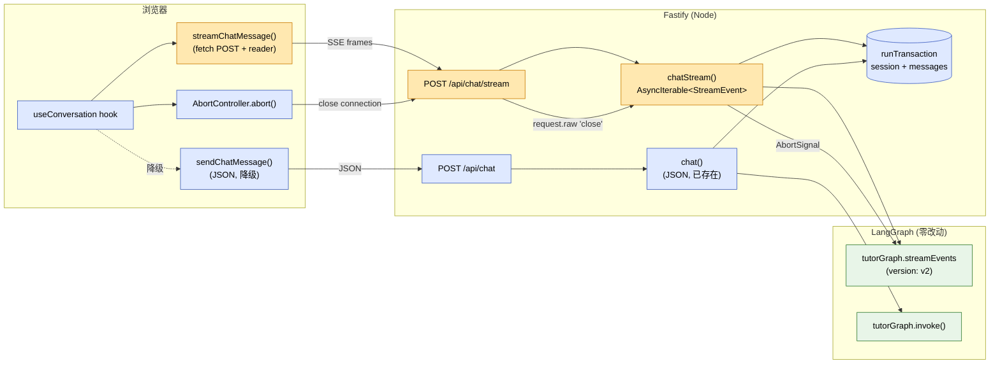
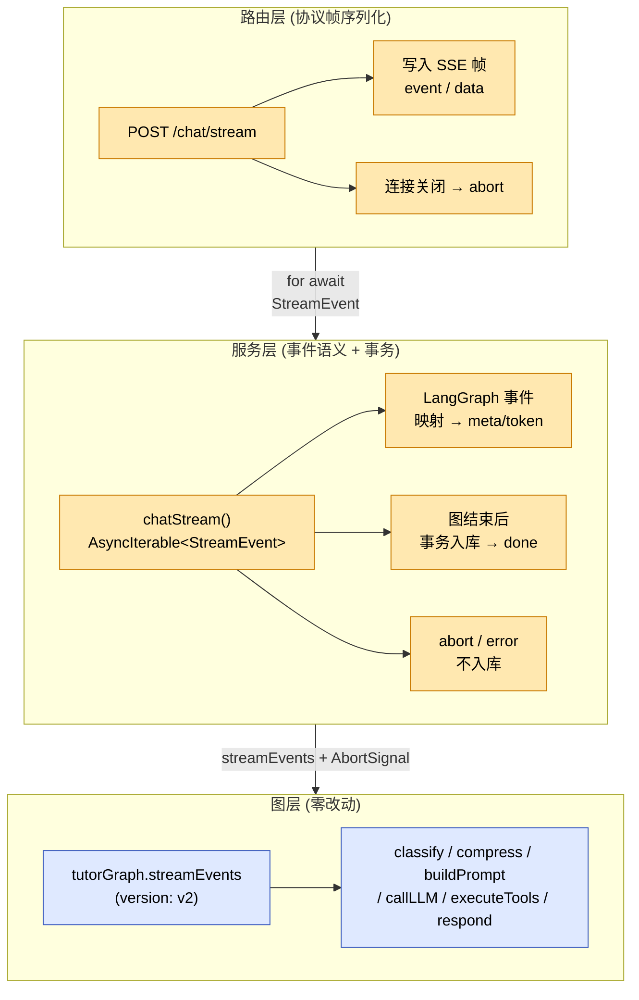
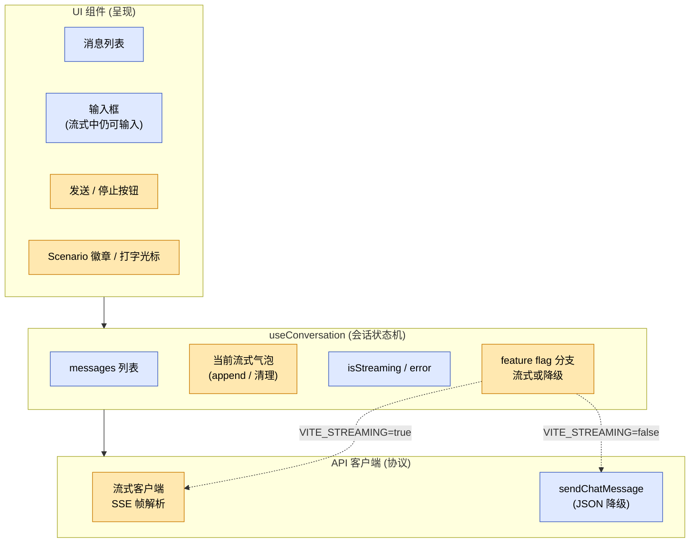
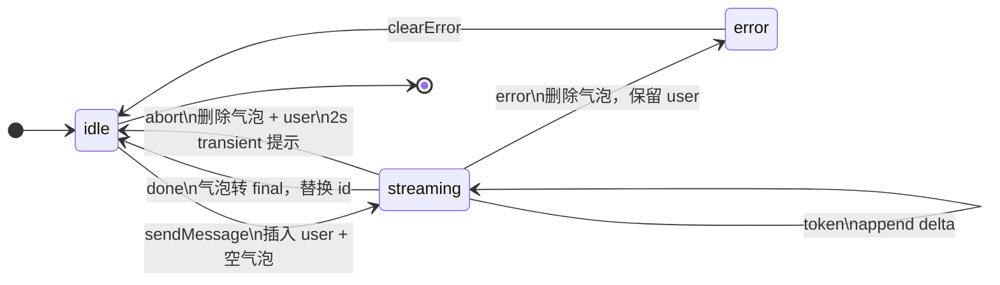

# Phase 4：Streaming 响应 — 设计文档

> 日期：2026-04-17
> 目的：在已完成 LangGraph 编排层改造的基础上，给 English Tutor Agent 加上逐 token 流式响应体验。
> 前提：读者已熟悉 `2026-04-07-langgraph-migration-design.md` 中定义的 `tutorGraph` 及其节点。
> 状态：设计阶段（本文件不含代码；实现细节留给实现计划 `docs/superpowers/plans/`）

---

## 目录

1. [改造目标与非目标](#1-改造目标与非目标)
2. [关键决策汇总](#2-关键决策汇总)
3. [架构总览](#3-架构总览)
4. [SSE 协议规范](#4-sse-协议规范)
5. [后端分层设计](#5-后端分层设计)
6. [前端分层与会话状态机](#6-前端分层与会话状态机)
7. [错误分类与持久化语义](#7-错误分类与持久化语义)
8. [测试策略](#8-测试策略)
9. [验收标准](#9-验收标准)
10. [风险与缓解](#10-风险与缓解)
11. [Feature Flag 与发布策略](#11-feature-flag-与发布策略)
12. [非目标](#12-非目标)
13. [术语表](#13-术语表)

---

## 1. 改造目标与非目标

### 1.1 目标

| # | 目标 | 衡量标准 |
|---|------|---------|
| G1 | **逐 token 呈现助手回答**，首字时延从"秒级"降到"亚秒级" | UI 在 `on_chat_model_stream` 首 chunk 到达后立刻渲染 |
| G2 | **用户可中途停止生成**，被停止的回合不落库 | 点击停止 → SSE 连接关闭 → 图 `AbortSignal` 触发 → `messages` 表无新行 |
| G3 | **保持对话历史一致性**：DB 里只存"完整回合" | 无论成功/失败/中止，`user + assistant` 两行要么一起写入、要么都不写 |
| G4 | **JSON 路径保持可用**，作为代码层降级通道 | `POST /api/chat` 行为与测试完全不变；`VITE_STREAMING=false` 时前端自动走它 |

### 1.2 非目标（此处为总览，详见 §12）

- 不实现工具调用进度事件（留作独立迭代）
- 不实现自动重试 / 自动降级（失败就显式失败）
- 不实现 E2E 浏览器测试
- 不改 `/history`、`/reset`、DB schema、RAG、session 结构
- 不改 LangGraph 图本体

---

## 2. 关键决策汇总

设计过程中所有双向决策的结论。后续实现/评审如需推翻，应补充理由并更新本节。

| 维度 | 决定 | 理由提要 |
|---|---|---|
| 传输协议 | POST + **SSE 帧格式**（严格规范） | 最贴合 LangGraph 事件流；未来切 `EventSource` 成本最小 |
| 客户端消费 | **`fetch(POST) + ReadableStream`**，前端手写 SSE 解析 | 保留 POST body、headers、AbortController |
| 端点形状 | **新增 `POST /api/chat/stream`，保留 `POST /api/chat`** | 一个 URL 一种协议；旧接口作降级通道 |
| 事件集合 | `meta` / `token` / `done` / `error`（**无工具进度**） | 收紧 Phase 4 范围，工具事件下次迭代 |
| 持久化时机 | **仅正常完成才入库**（事务与 `chat()` 对齐） | 维持"完整回合"不变量 |
| 中止语义 | **客户端断开即中止**；中止回合**不入库** | 省 token；避免"半截回答"污染历史 |
| 中止时 UI | **移除本轮 user 消息**；显示 2s transient "已停止"提示 | UI 与 DB 保持"只存完整回合"一致 |
| UI 范围 | 打字机、光标、停止按钮、scenario 徽章、滚动跟随、输入框不 disable | 覆盖必要体验，不做过度工程 |
| Markdown 策略 | **裸奔**（不引入容错渲染器） | 当前回答以自然语言为主，闪烁可接受 |
| 测试层级 | 后端纯函数 + 后端路由集成 + 前端 hook 状态机 | 覆盖协议、事务、abort、UI 状态机 |
| `chatModel` 替身方式 | **`vi.mock('@/llm/model')`** | 不为测试引入 DI 容器 |
| Feature flag | **`VITE_STREAMING`，默认 `true`** | 前端构建时开关；代码层 fallback 保持工作 |
| 后端分层 | **Route（协议帧）⟂ Service（事件 + 事务）⟂ Graph（零改动）** | AsyncIterable 契约；可测 / 可替换协议 |

---

## 3. 架构总览

**关键边界：**
- **LangGraph 图本体零改动** —— `classify/compress/buildPrompt/callLLM/executeTools/respond` 全部复用。
- **事务边界等价于现有 `chat()`** —— 一次 `runTransaction` 写入 `session.save()` + 两条 `messages`。
- **`AbortSignal` 从 Fastify 连接 → `chatStream` → `streamEvents`** 一路透传，取消粒度对齐底层。

---

## 4. SSE 协议规范

### 4.1 响应头契约

| Header | 值 | 理由 |
|---|---|---|
| `Content-Type` | `text/event-stream; charset=utf-8` | SSE 规范 |
| `Cache-Control` | `no-cache, no-transform` | 禁用缓存与转换 |
| `Connection` | `keep-alive` | 保持长连接 |
| `X-Accel-Buffering` | `no` | 关反向代理输出缓冲（避免"流式变一次性"） |

### 4.2 帧形态

严格遵守 SSE 规范（`event:`、`data:`、`\n\n` 结束），便于未来切换至原生 `EventSource`。

- `event` 字段仅取 4 个值之一：`meta` / `token` / `done` / `error`
- `data` 字段为**单行 JSON**
- 心跳可选：`: keep-alive\n\n`（注释行，SSE 规范允许）

### 4.3 事件集合

| event | data 形态 | 含义 | 出现次数 |
|---|---|---|---|
| `meta` | `{ scenario }` | 分类结果 | 0 或 1 次（若出现，必早于所有 `token`） |
| `token` | `{ delta }` | 助手回答增量 | 0..N 次 |
| `done` | `{ messageId, scenario, replyLength }` | 正常终态 | 与 `error` 二选一；仅 1 次 |
| `error` | `{ code, message }` | 异常终态 | 与 `done` 二选一；仅 1 次 |

### 4.4 帧序列不变量

1. `meta` 至多一次，且必在所有 `token` 之前。
2. 终态 **二选一**：`done` 或 `error`，仅出现一次。
3. **合法中止不发终态帧**；客户端通过自己触发的 `AbortController` 识别中止。
4. 除"合法中止"外，任何失败必须写终态帧。

### 4.5 LangGraph 事件 → StreamEvent 映射

| LangGraph (`streamEvents v2`) | StreamEvent | 时机 |
|---|---|---|
| `on_chain_end`（节点 `classify`） | `meta` | classify 结束后一次 |
| `on_chat_model_stream`（非空 `chunk.content`） | `token` | callLLM 每 chunk；工具循环期间也属于同一条助手消息 |
| 异步迭代正常结束后 | `done` | 事务入库**之后** |
| 异步迭代抛非 `AbortError` | `error` | 不入库 |
| `signal.aborted === true` | — | 不 yield；迭代静默结束，不入库 |

---

## 5. 后端分层设计

### 5.1 分层职责

| 层 | 唯一职责 | 不负责 |
|---|---|---|
| 路由 | 协议帧序列化、SSE 响应头、连接生命周期 → abort 传导 | 事件语义、持久化、LangGraph 细节 |
| 服务 | LangGraph 事件 → StreamEvent 映射；图结束后事务入库；abort / error 的分类 | 协议帧格式、HTTP |
| 图 | 保持不变 | — |

### 5.2 契约

- **服务层对路由层的契约**：一个 `AsyncIterable<StreamEvent>`，按 §4.4 不变量 yield。
- **服务层对持久化的契约**：与现 `chat()` 相同——**成功一次 `runTransaction`**；失败/中止**不写任何行**。
- **路由层对服务层的契约**：在生成器迭代开始前完成 SSE 握手；在 `request.raw` 断开时调用传入的 `AbortController.abort()`。

---

## 6. 前端分层与会话状态机

### 6.1 分层

**分层不变量：**
- **API 客户端**只做协议：POST 请求、读取 SSE 字节流、按规范帧解析、调用传入的回调。不懂业务、不碰 React 状态。
- **Hook** 只做状态机：消息列表的增删改、流式气泡的 append、中止清理、feature flag 分支。不懂 SSE 语法。
- **UI 组件** 只做呈现，不持有"正在流式"等状态。

### 6.2 会话状态机

### 6.3 流式气泡可见性契约

- `sendMessage(text)` 被调用时，**立即**把 user 消息和一个空的、pending 态的 assistant 气泡加入列表（不等 SSE 首帧）。
- 收到 `meta` → 给该气泡打 scenario 徽章。
- 收到 `token` → append `delta` 到该气泡 content。
- 收到 `done` → 把临时 id 替换为后端下发的 `messageId`，状态改为 `final`。
- 收到 `error` → **删除**该气泡（保留 user 消息），进入 `error` 状态。
- 触发 abort → **删除**该气泡 **+** **删除**本轮 user 消息，显示 transient 提示。

这保证：
1. 打字机体验自然（不是等到首个 token 再创建气泡）。
2. DB 的"完整回合"不变量在 UI 层镜像呈现。
3. 成功 / 失败 / 中止的 UI 清理逻辑都由 hook 驱动，组件无需感知。

### 6.4 `isStreaming` 与输入体验

- 现有 `isLoading` 升级为 `isStreaming`（语义相同：从 `sendMessage` 起到 `done/error/abort` 止）。
- UI 在 `isStreaming` 时把发送按钮切成"停止"，**不禁用输入框**。
- 工具循环期间所有 token 仍 append 到同一条助手气泡，不会裂成多条。

---

## 7. 错误分类与持久化语义

| 错误类别 | 触发来源 | 协议表现 | 持久化 | UI 表现 |
|---|---|---|---|---|
| 合法中止 | 用户点停止 / 网络断 | 连接关闭，无终态帧 | 不入库 | 移除流式气泡 + 本轮 user 消息；transient "已停止" 2s |
| 输入校验失败 | 请求体 schema 拒绝 | **不进入流式**，返回 **400 JSON** | 不入库 | 与现有 `/chat` 校验错误一致 |
| 上游 LLM 错误 | 图运行中抛 | `event: error`（`code: LLM_ERROR`） | 不入库 | 保留 user，显示错误，状态进 `error` |
| 工具执行错误 | `executeTools` 节点抛 | `event: error`（`code: TOOL_ERROR`） | 不入库 | 同上 |
| 内部异常 | service 层 bug | `event: error`（`code: INTERNAL`） | 不入库 | 同上 |
| 持久化失败 | 事务抛（图已成功） | `event: error`（`code: PERSIST_ERROR`） | 不入库 | 保留 user，显示错误（避免"成功假象"） |

**核心不变量**：
- 除合法中止外，任何失败都必须有终态帧。
- 合法中止通过「连接关闭 + 客户端自己触发 abort」识别，不依赖后端下发的帧。
- 持久化只在「图正常跑完 + `done` 前」发生；任何其他路径都不写库。

---

## 8. 测试策略

### 8.1 测试金字塔

| 层 | 目标 | 断言形态 |
|---|------|---------|
| 单元（后端） | SSE 序列化、事件过滤/映射是纯函数 | 输入 LangGraph 事件序列 → 输出 StreamEvent 序列 / SSE 帧字节流 |
| 集成（后端） | 路由 + 服务层 + 持久化 + abort 的协同 | 模拟 LLM chunk 流；断言帧顺序、DB 行数、abort 不写库、错误帧正确 |
| 单元（前端 hook） | 会话状态机 | 模拟 SSE 响应流；断言 `messages` 在 meta/token/done/error/abort 下的演变 |

### 8.2 替身方式

- `chatModel` 替身统一走 **`vi.mock('@/llm/model')`**——不为测试引入 DI 容器。
- 可复用测试基建：SSE 帧解析器、StreamEvent 序列断言工具、LLM chunk 流 mock 工厂。

### 8.3 必测场景

1. 正常完成：首帧 `meta` → N 条 `token` → `done` → DB 写入 2 行。
2. 用户中止：中途关闭连接 → 图 abort → DB 无新行 → 客户端 `messages` 清理本轮。
3. 上游错误：LLM 抛 → `event: error` → DB 无新行 → UI 保留 user + 显示错误。
4. 带工具的流式路径：token 流中穿插工具循环，最终属于同一条助手消息（不分裂成多条）。
5. Scenario 在 `meta` 帧与 `done` 帧中一致。

### 8.4 不做

- E2E 浏览器测试
- 组件视觉回归测试
- 真实 LLM 契约测试

---

## 9. 验收标准

Phase 4 可对外宣布完成的必要条件：

- [ ] 默认 UI 体验：发送消息后 < 1s 看到首个 token；打字机效果无卡顿。
- [ ] Scenario 徽章在首个 token 之前 / 同时出现。
- [ ] 停止按钮在流式期间可见；点击后 UI 本轮清空、后端日志观察到 abort、DB 无新行。
- [ ] 刷新页面从 `/history` 加载，中止的回合完全不出现；成功的回合与非流式一致。
- [ ] JSON 降级：设 `VITE_STREAMING=false` 后，行为与当前 `main` 完全一致（已有测试全绿）。
- [ ] 所有既有测试通过；新增三层测试全绿。
- [ ] 手动验证 `verify-streaming.ts` 脚本依然可运行（作为流式底层的烟雾测试）。

---

## 10. 风险与缓解

| 风险 | 影响 | 缓解 |
|---|---|---|
| `streamEvents v2` 的 root `on_chain_end` 不带完整最终 state | `done` 帧凑不齐字段 / 持久化无数据 | 实现前先用 `verify-streaming.ts` 实测；若不达标，改为并行订阅 `stream("values")` 取 lastValue |
| `AbortSignal` 对 LangGraph 的传播粒度不如预期 | 停止按钮需等当前 chunk 走完才响应 | 可接受（秒级响应）；文档中明确"停止 = 尽快中止"非"立即切断" |
| 反代/WAF 默认缓冲 SSE 响应 | 用户看到的是一次性到达而非流式 | 设 `X-Accel-Buffering: no`、禁用代理 response buffering；dev 直连不受影响 |
| 工具循环期间的 token 被误认为新消息 | 一次回合在 UI 上断成多条气泡 | Hook 只认"当前流式气泡"；工具循环时 token 仍 append 到同一个气泡 |
| Markdown 残缺态抖动（裸奔决议） | 代码块/表格在流式中短暂变形 | 记入"已知限制"；如反馈强烈再升级到容错渲染器，不阻塞本次上线 |
| 长回答期间被浏览器/代理断连 | 流中被切 | 观察；必要时后端周期性发心跳注释帧 `: keep-alive\n\n`，规范允许且无副作用 |

---

## 11. Feature Flag 与发布策略

- **开关**：构建时环境变量 `VITE_STREAMING`，默认 `true`。
- **位置**：hook 内部一条分支，对 UI 组件透明；组件消费的 props 契约在两种模式下一致。
- **降级能力**：`sendChatMessage()` + `POST /api/chat` 保持原样，是代码层降级通道（非自动降级）。
- **回滚**：流式若出问题，改 env → 重建前端即可；不需要回滚后端（新路由与旧路由互不依赖）。
- **不做自动降级**：失败就要暴露，避免"偶尔变慢"掩盖 bug。

---

## 12. 非目标

- 工具调用进度事件（`tool_start / tool_end`）——独立迭代。
- 自动重试 / 自动从流式降级到 JSON——违背"失败要显式"原则。
- E2E / 视觉回归测试——项目尚无相关基建，ROI 低。
- LangGraph 图结构调整（节点拆分、并行度变化）——保持零改动。
- 多会话 / 多 tab 的流式隔离——当前是单 session 架构。
- TTS / 数字人（Phase 5 / 6）——本阶段只做文字流。
- LangGraph 持久化替换 session 存储——与本次无关。

---

## 13. 术语表

| 术语 | 含义 |
|---|---|
| SSE | Server-Sent Events，HTTP `text/event-stream` 单向事件流 |
| StreamEvent | 服务层内部的事件类型：`meta` / `token` / `done` / `error` |
| 流式气泡 | UI 中与当前 `streaming` 状态对应的、还未终态的 assistant 消息占位 |
| 合法中止 | 用户主动点停止或网络断开导致的中止；不发终态帧、不入库 |
| 完整回合 | 一次 `user → assistant` 的成功往返；DB 只存完整回合 |
| 降级通道 | `VITE_STREAMING=false` 时 hook 走 `sendChatMessage()` → `POST /api/chat` 的代码路径 |
